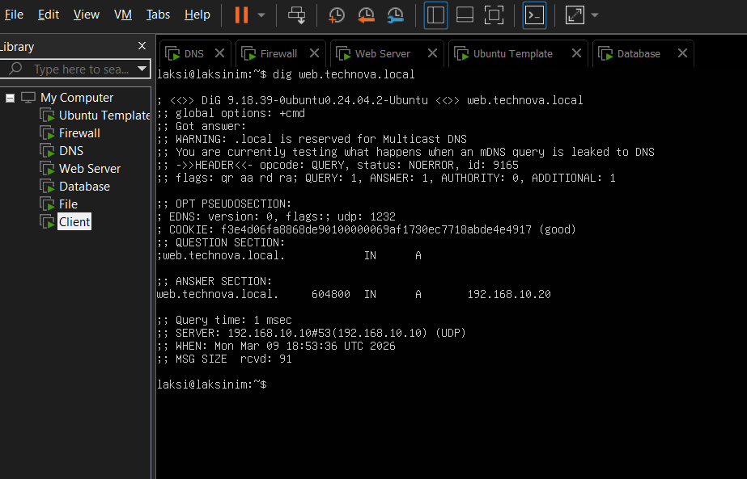
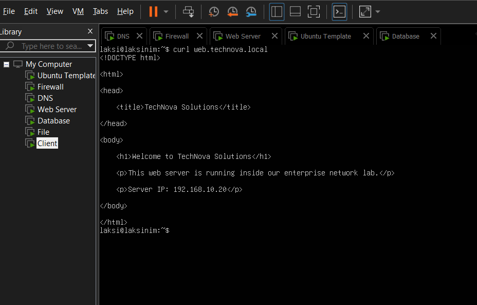
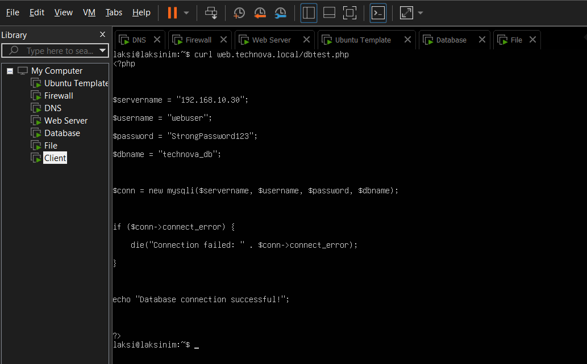

# Linux Enterprise Network Infrastructure Lab

This project simulates a small enterprise network infrastructure using multiple Linux servers deployed in VMware.

The environment includes DNS, Web, Database, and File servers integrated together within a secured internal network.

---

## Network Architecture
              

```
                    Internet
                        |
                Firewall / Gateway
                  192.168.10.1
                        |
          --------------------------------
           Internal Network 192.168.10.0/24
                        |
     ------------------------------------------------
      |               |             |               |
    DNS             WEB           DB             FILE
192.168.10.10   192.168.10.20  192.168.10.30  192.168.10.40
   Bind9       Apache + PHP      MariaDB        Samba
                        |
                    Client VM
                 192.168.10.100
```
## Infrastructure Testing

### DNS Resolution


### Web Server Access


### Database Connectivity


### File Server Access


```
